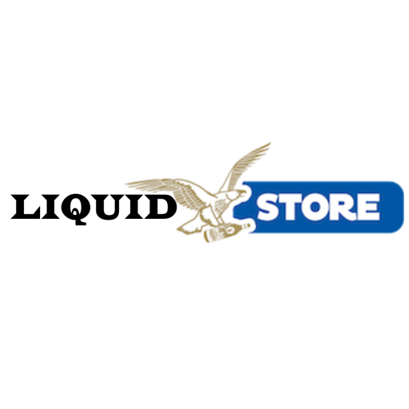

# LiquidStoreAPP

## LiquidStoreAPP es un proyecto del curso de React Native dictado en CoderHouse comisión 53280, para desarrollo de Aplicaciones mobiles para Android y iOS.

[![Button Icon]][Link]

[Link]: https://expo.dev/artifacts/eas/urr5TWAM17QdNp87Cm7CJS.apk "Descargar el archivo APK para instalar en Android."
[Button Icon]: https://img.shields.io/badge/DOWNLOAD_APK-198754?style=for-the-badge&logoColor=white&logo=DocuSign

[![VideoLink]][LinkVideo]

[LinkVideo]: https://res.cloudinary.com/dg8ndxl2y/video/upload/v1711670080/LiquidStoreAPP_exampleVideo_vidvrw.mp4 "Descargar el archivo APK para instalar en Android."
[VideoLink]: https://img.shields.io/badge/DEMO_Video-F17105?style=for-the-badge&logoColor=white&logo=youtube

&nbsp;

### Tecnologías utilizadas

---

&nbsp;

### La aplicación LiquidStoreApp es un store de venta de bebidas, se utiliza los mismos recursos que cree para el curso de react js.

De esta forma se implementan practicas propias, adaptando lo visto en clase pero utilizando mis propias herramientas.

&nbsp;

---

&nbsp;

## Pre entrega clase 7:

Como primera pantalla vemos la lista de categorías para seleccionar. Al seleccionar una lista cambia la pantalla a la lista de productos. Aquí se incluyó en la APPBar el botón de volver así como un botón para abrir el buscador.
Una vez abierto el buscador el botón cambia a una cruz para cerrarlo.
El buscador es minimalista, solo tiene el input para buscar, y va realizando la búsqueda a medida que se va escribiendo. Al cerrar el buscador se reinician los valores.

Al seleccionar un producto pasamos a la pantalla producto, donde cambia el título nuevamente, se oculta el botón del buscador y se ve una tarjeta con el detalle del producto.
Se trabajó en muchos detalles visuales, en el header para que todo quede alineado aunque ocultemos componentes, así como cuando el texto desborda y que tipo de iconos se debe mostrar en cada momento. También está todo listo para implementar el modo oscuro cuando veamos schemas.
Se agregaron las fuentes Roboto en varias de sus formas.

&nbsp;

## Pre entrega clase 9:

Para esta pre entrega se requería la implementación de la librería Navigation, la cual se implemento exitosamente. Otro de los puntos claves era ajustar el Header, pero por cuestiones de estética y de practicar, se implemento el Header original de la librería en vez del personalizado que ya tenia desarrollado, de esta forma pude practicar con sus propios componentes y editar por ejemplo los iconos del header variándolos dependiendo del estado del componente, mediante el método `navigation.setOptions()`.
También se ajusto la barra de búsqueda al nuevo componente.
Por ultimo se agrego el componente `ActivityIndicator` mientras se carga la fuente.

Para estos trabajos se fueron creando ramas, donde se dejaron copias de la version anterior.

&nbsp;

## Pre entrega clase 11:

Para esta pre entrega se requiere la implementación de una Bottom Tab Bar y de manejo de Estados mediante Redux, las cuales se implementaron correctamente.

Respecto de la tab bar, se utilizaron métodos diferentes al profesor para darle estilos a los botones cuando están o no seleccionados. También se modificó el main navigator.js para que sea la TabBar la principal y el Stack Navigation la secundaria dentro de una Tab. Para la Tab Shop se utiliza el header de del Stack, para el resto se utiliza el header de la TabBar.
En la segunda Tab se implementa el carrito, el cual contiene en su header un botón para vaciarlo, previo verificarlo con el usuario mediante un Alert.
Luego contiene una lista de los productos que se van agregando.
La tercer TabBar se coloco a modo de reservar el espacio, no siendo aun trabajada.

Como valor agregado se desarrolló un componente que permite manipular la cantidad de unidades a agregar de un mismo producto, el mismo tiene controles para que no sea menor a cero, ni mayor al stock, así como también que en caso de no haber stock no habilita el botón comprar.Otro componente similar se agregó en las Card del carrito con la diferencia que al agregar o quitar productos se actualiza en tiempo real el carrito.

Mediante la implementación de Redux, se construyó un estado general para el carrito, se agregaron más datos como Cantidad Total, la cual también va actualizando el Badge del TabBar del carrito.
Se diseñaron funciones dentro del Slice que se reutilizan para actualizar el importe total y la cantidad total al momento de agregar o sacar unidades y eliminar un productoSe agregaron todos los controles y funcionalidades para agregar unidades o productos, eliminar unidades, eliminar productos previa confirmación y eliminar el carrito completo, así como su visualización cuando está vacío.

&nbsp;

## Preentrega clase 15:

Para esta preentrega se requiere la implementación de persistencia de datos en la nube, mediante **redux toolkit**, para lo cual se utiliza firebase realtime database como base de datos noSQL, también se utiliza **firebase authentication** para la login y autentificación de usuarios, y se implementa correctamente el uso de **Device Features** como la cámara de fotos del dispositivo.

Se diseñó la pestaña Órdenes, donde se van almacenando las órdenes generadas por cada usuario, las mismas se persisten en base de datos, discriminando el usuario que realiza la compra. En el carrito se agrega un control que no permita la compra si no está logueado. A diferencia del profesor, no tiene que estar logueado para ver la aplicación, sino que puede navegar y generar carritos, y recién cuando proceda a comprar, se le solicita el login. El componente Órdenes tiene 3 posibles estados, cuando está cargando muestra un icono de carga, si no tiene ninguna compra, muestra que no se realizó ninguna compra aun y si el usuario realizó alguna compra, muestra un listado en forma de tarjetas de todas las compras filtradas por usuario, las cuales se bajan directamente de la base de datos.

Se diseñó la pestaña User, que contiene un componente de navigation tipo `drawer`, el mismo tiene un condicional que muestra el login y register si no esta logueado, y si esta logueado muestra la pantalla de configuración de usuario. Para el formulario de login y de registro se implementaron validaciones mediante `Yup`. A su vez la pestaña User contiene un Navigation Stack para mostrar luego las screen para utilización de la cámara y a futuro del posicionamiento. Al momento de registrarse se solicita como dato adicional, el nombre de la persona, el cual se almacena en el displayName de authentication, de esta forma al loguearse se usa este nombre en el label de login de la TabBar, para darle la indicación al usuario que ya está registrado.

Como valor agregado se implementó el modo claro, modo oscuro en toda la aplicación, al cual se accede luego de loguearse. A futuro se persistirá en base de datos para guardar la configuración favorita del usuario.
Respecto del uso de la cámara, la misma se implementa correctamente, y se persiste la imagen en base de datos.

&nbsp;

---

## Entrega Final:

Para la entrega final se implemento en primera instancia la ubicación del dispositivo mediante la solicitud de permisos y el uso de la Localización del gps del equipo. para ello se generó un nuevo componente para solicitar la ubicación, mostrarla en el mapa y confirmarla por ate del usuario.
También se persistió en el perfil del usuario en la nube la imagen, la ubicación y la preferencia de colores light o dark.

Como siguiente paso se implemento `SQLite` como almacenamiento local de datos. de esta forma se pudo persistir localmente los datos del usuario.

Como valor agregado se realizaron las siguientes modificaciones al proyecto, fuera de programa e integrando y ampliando los conocimientos.

1. Refactorización del servicio de register y login, para solicitar adicionalmente el `refreshToken`
2. Al momento del login exitoso, se guardan los datos del usuario en `SQLite`, incluyendo la `refreshToken`. Para esto se tuvo que refactorizar la base de datos completa, ya que para agregar nuevas columnas en la tabla `sessionUser`, hay que eliminar la tabla completa y volver a crearla desde cero con las nuevas columnas. de esta forma también se crearon 2 nuevos servicios de base de datos, uno para eliminar la tabla completa llamado `eraseTable` y otro para visualizar las tablas que tengamos creadas y como están computas sus columnas llamado `show`. De esta forma se ampliaron los usos y conocimientos en implementación de SQLite.
3. Creación de un nuevo servicio a un nuevo endpoint para refrescar la sesión del usuario en firebase, mediante la `refreshToken`. de esta forma podemos refrescar la sesión del usuario, sin necesidad de almacenar el password ni tener que volver a solicitarlo.
4. Implementación del `Device Feature: Local Authentication`, el cual luego de superar las verificaciones de requisitos de hardware y habilitación, le solicita la huella digital al usuario, de esta forma al superar la autentificación, se envía el `refreshToken` a firebase, el cual nos devuelve un nuevo Token de autorización y refresca el tiempo de login nuevamente.
5. A su vez en caso de que el usuario no supere la autenticación por huella digital, se borran los datos de acceso del almacenamiento local del dispositivo, obligando al usuario no autorizado a volver a loguearse para acceder a los datos.

Finalmente se implemento el cliente de Expo Application Services, (eas-cli) para realizar las funciones de compilación tanto para producción como para desarrollo. Pudiendo generar el archivo APK para instalar de forma local.

&nbsp;

---

## Librerías utilizadas

- Expo
- Expo fonts
- Expo status bar
- Expo Image Picker
- Expo Gesture Handler
- Expo local authentication
- Expo SQLite
- React Native Reanimated
- Navigation Stack
- Navigation Bottom Tabs
- Navigation Drawer
- Vector Icons
- Redux
- Redux toolkit
- Yup
- eas-cli

## Persistencia de Datos - Cloud

- Firebase Realtime Database
- Firebase Authentication

## Persistencia de Datos - Local

- SQLite

## Compilación

- Expo Application Services - (eas-cli)

&nbsp;

&nbsp;

## Juan Pablo Sarobe

[Contact Me](mailto:jp.sarobe@gmail.com)

 
 

&nbsp;

&nbsp;
